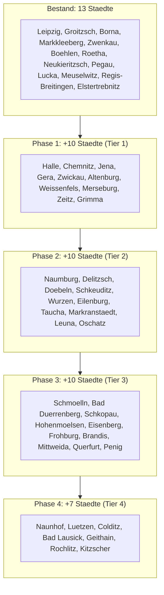

# Lokale Expansion: Von 13 auf 50 Staedte

## Ausgangslage

Aktuell **13 Staedte** abgedeckt -- ueberwiegend Kleinstaedte im direkten Umkreis von Groitzsch (Landkreis Leipzig + Altenburger Land). Leipzig ist die einzige Grossstadt.

Pro Stadt entstehen **6 Seiten** (1 Hub + 5 Services), jede mit **eigenem Content** (wie im bestehenden Schema: [src/data/regionContent.ts](src/data/regionContent.ts) + [src/data/regionServiceContent.ts](src/data/regionServiceContent.ts)).

**Ziel: 50 Staedte = 300 Seiten (aktuell 78, neu 222)**

---

## Alle 37 neuen Staedte (4 Tiers)

### Tier 1 -- Grossstaedte + nahe Mittelstaedte (Phase 1, 10 Staedte)

Hoechste Prioritaet: grosse Einwohnerzahlen und/oder sehr nah an Groitzsch. Sofortiger SEO-Effekt.

- **Halle (Saale)** -- ~240.000 EW, ~40 km, Saalekreis. Zweitgroesste Stadt Sachsen-Anhalts, Universitaet, starke Wirtschaft.
- **Chemnitz** -- ~245.000 EW, ~75 km, Sachsen. Drittgroesste Stadt Sachsens, Kulturhauptstadt 2025, starker Mittelstand.
- **Jena** -- ~110.000 EW, ~75 km, Thueringen. Technologie- und Universitaetsstadt, viele innovative KMU.
- **Gera** -- ~93.000 EW, ~60 km, Thueringen. Drittgroesste Stadt Thueringens, Dienstleistungszentrum.
- **Zwickau** -- ~90.000 EW, ~65 km, Sachsen. Automobilindustrie, starker Mittelstand.
- **Altenburg** -- ~32.000 EW, ~25 km, Altenburger Land. Kreisstadt, schliesst Luecke zu Lucka/Meuselwitz.
- **Weissenfels** -- ~40.000 EW, ~30 km, Burgenlandkreis. Groesste Stadt im Kreis.
- **Merseburg** -- ~34.000 EW, ~35 km, Saalekreis. FH Merseburg, Industriestandort.
- **Zeitz** -- ~28.000 EW, ~25 km, Burgenlandkreis. Sehr nah, historische Industriestadt.
- **Grimma** -- ~28.000 EW, ~35 km, Landkreis Leipzig. Wichtigste fehlende Stadt im eigenen Landkreis.

**= 60 neue Seiten**

### Tier 2 -- Mittelstaedte mit Substanz (Phase 2, 10 Staedte)

Solide Einwohnerzahlen, gute regionale Verankerung, fuellen geographische Luecken.

- **Naumburg** -- ~32.000 EW, ~45 km, Burgenlandkreis. UNESCO-Weltkulturerbe, Tourismus + Wirtschaft.
- **Delitzsch** -- ~25.000 EW, ~45 km, Nordsachsen. Nahe Leipzig-Nord, wachsende Stadt.
- **Doebeln** -- ~24.000 EW, ~55 km, Mittelsachsen. Wirtschaftsstandort zwischen Leipzig und Chemnitz.
- **Schkeuditz** -- ~18.000 EW, ~30 km, Nordsachsen. Flughafen Leipzig/Halle, DHL-Hub, viele Unternehmen.
- **Wurzen** -- ~16.000 EW, ~45 km, Landkreis Leipzig. Traditionsstadt, Industrie.
- **Eilenburg** -- ~16.000 EW, ~50 km, Nordsachsen. Grosse Kreisstadt.
- **Taucha** -- ~16.000 EW, ~35 km, Nordsachsen. Wachsende Stadt am Leipziger Rand.
- **Markranstaedt** -- ~15.000 EW, ~20 km, Landkreis Leipzig. Sehr nah, direkter Einzugsbereich.
- **Leuna** -- ~14.000 EW, ~30 km, Saalekreis. Chemiepark Leuna, viele B2B-Kunden.
- **Oschatz** -- ~14.000 EW, ~60 km, Nordsachsen. Regionales Zentrum.

**= 60 neue Seiten**

### Tier 3 -- Kleinstaedte mit Relevanz (Phase 3, 10 Staedte)

Kleinere Staedte, aber strategisch wichtig: fuellen Luecken, wenig SEO-Wettbewerb, lokale Sichtbarkeit.

- **Schmoeolln** -- ~12.000 EW, ~35 km, Altenburger Land. Verbindung Altenburg--Gera.
- **Bad Duerrenberg** -- ~12.000 EW, ~25 km, Saalekreis. Kurstadt, nah an Merseburg.
- **Schkopau** -- ~11.000 EW, ~35 km, Saalekreis. Chemiestandort Buna, viele Betriebe.
- **Hohenmoelsen** -- ~10.000 EW, ~20 km, Burgenlandkreis. Sehr nah an Groitzsch.
- **Eisenberg** -- ~11.000 EW, ~50 km, Saale-Holzland-Kreis. Kreisstadt, Keramik-Industrie.
- **Frohburg** -- ~10.000 EW, ~15 km, Landkreis Leipzig. Direkter Nachbar von Groitzsch.
- **Brandis** -- ~10.000 EW, ~35 km, Landkreis Leipzig. Nahe Leipzig-Ost.
- **Mittweida** -- ~15.000 EW, ~65 km, Mittelsachsen. Hochschulstadt, Tech-Affinitaet.
- **Querfurt** -- ~11.000 EW, ~50 km, Saalekreis. Regionales Zentrum.
- **Penig** -- ~9.000 EW, ~50 km, Mittelsachsen. Zwischen Leipzig und Chemnitz.

**= 60 neue Seiten**

### Tier 4 -- Auffuellung auf 50 (Phase 4, 7 Staedte)

Runden das Netzwerk ab, schliessen die letzten geographischen Luecken.

- **Naunhof** -- ~9.000 EW, ~30 km, Landkreis Leipzig. Nahe Leipzig-Suedost.
- **Luetzen** -- ~9.000 EW, ~20 km, Burgenlandkreis. Historische Stadt, sehr nah.
- **Colditz** -- ~9.000 EW, ~40 km, Landkreis Leipzig. Bekannte Burgstadt.
- **Bad Lausick** -- ~8.000 EW, ~20 km, Landkreis Leipzig. Kurort, direkter Nachbar.
- **Geithain** -- ~7.000 EW, ~20 km, Landkreis Leipzig. Sehr nah an Groitzsch.
- **Rochlitz** -- ~6.000 EW, ~45 km, Mittelsachsen. Regionales Zentrum an der Mulde.
- **Kitzscher** -- ~5.000 EW, ~10 km, Landkreis Leipzig. Direkter Nachbar, kompletiert lokale Abdeckung.

**= 42 neue Seiten**

---

## Gesamtuebersicht

**Nach Phase 4: 50 Staedte, 300 Seiten (92 bestehend + 222 neu)**

---

## Technische Umsetzung (pro Phase identisch)

### 1. Daten erweitern

- [src/data/leistungsgebiete.ts](src/data/leistungsgebiete.ts): Neue Staedte in `LEISTUNGSGEBIETE_CITIES` und `AREA_SERVED_NAMES` eintragen (Slug, Name, Subtitle/Region)
- [src/data/regionContent.ts](src/data/regionContent.ts): Pro Stadt einen eigenen `customRegionContent`-Eintrag mit: `name`, `metaDescription`, `intro`, `paragraphs[]`, `faqs[]`, `servicesHighlight[]`
- [src/data/regionServiceContent.ts](src/data/regionServiceContent.ts) + [src/data/regionServiceContentCustom.ts](src/data/regionServiceContentCustom.ts): Pro Stadt x 5 Services = einzigartige Eintraege mit `metaDescription`, `intro`, `paragraphs[]`, `faqs[]`, `highlights[]`

### 2. Sitemap aktualisiert sich automatisch

Die Sitemap in [src/lib/sitemap.ts](src/lib/sitemap.ts) iteriert ueber `LEISTUNGSGEBIETE_SLUGS` und `SERVICE_SLUGS` -- neue Staedte erscheinen automatisch in `sitemap-regional.xml`.

### 3. Interlinking entsteht automatisch

Die `RegionPage`-Komponente verlinkt bereits automatisch zu allen anderen Regionen. Neue Staedte werden sofort intern verlinkt.

### 4. Kein Template-Aenderung noetig

Die bestehenden Seiten-Templates ([region]/page.tsx und [region]/[service]/page.tsx) sowie Views (RegionPage.tsx, RegionServicePage.tsx) funktionieren ohne Aenderung -- sie lesen die Daten dynamisch aus den Content-Dateien.

---

## Content-Aufwand

- **Pro Stadt:** 6 Seiten mit je einzigartigem Content (1 Hub + 5 Services)
- **Pro Phase:** 60 Seiten (bzw. 42 in Phase 4)
- **Gesamt neu:** 222 Seiten
- **Content pro Seite:** metaDescription, Intro, 3-4 Absaetze, 3-5 FAQs, Highlights -- jeweils mit lokalem Bezug zur Stadt (Wirtschaft, Branchen, Besonderheiten)

---

## Warum diese Auswahl?

- **Grossstaedte zuerst** (Halle, Chemnitz, Jena, Gera, Zwickau): Hoechstes Suchvolumen, wenig Wettbewerb fuer "KI-Agentur [Stadt]"
- **Altenburg** schliesst die Luecke im Altenburger Land (Kreisstadt fehlt, obwohl Lucka + Meuselwitz da sind)
- **Merseburg, Weissenfels, Zeitz** decken Sueden Sachsen-Anhalts ab -- aktuell komplett unabgedeckt
- **Schkeuditz** hat den Flughafen/DHL-Hub -- hohe Firmendichte
- **Leuna, Schkopau** sind Chemie-Industriestandorte mit vielen B2B-Kunden
- **Nahe Kleinstaedte** (Frohburg, Kitzscher, Geithain, Bad Lausick) komplettieren die lokale Dominanz rund um den Hauptsitz Groitzsch
