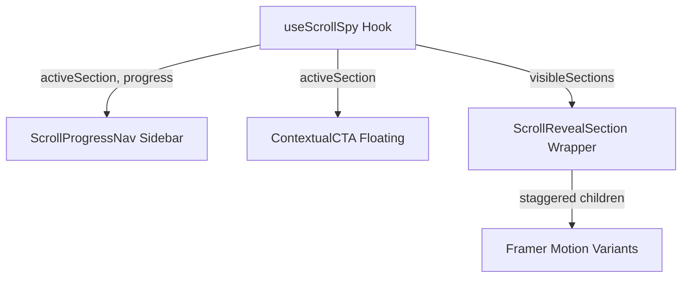

# Scroll-Based Content Reveal System

## Architektur



## 1. `useScrollSpy` Hook -- [src/hooks/useScrollSpy.ts](src/hooks/useScrollSpy.ts) (neu)

Zentraler Hook, der per `IntersectionObserver` trackt, welche Sections sichtbar sind.

**Rückgabewerte:**
- `activeSection: string` -- ID der aktuell dominanten Section (groesster sichtbarer Anteil)
- `visibleSections: Set<string>` -- alle aktuell sichtbaren Section-IDs
- `progress: number` -- Gesamtfortschritt der Seite (0-1)

**Konfiguration:**
- `sectionIds: string[]` -- welche Section-IDs beobachtet werden
- `rootMargin` -- Offset fuer fruehe Erkennung (z.B. `-20% 0px -20% 0px`)
- `threshold` -- Array von Schwellen fuer granulares Tracking

Nutzt `IntersectionObserver` mit `threshold: [0, 0.25, 0.5, 0.75, 1]` und trackt die `intersectionRatio` jeder Section. Die Section mit der hoechsten Ratio wird `activeSection`. `progress` wird ueber `window.scrollY / (document.body.scrollHeight - window.innerHeight)` berechnet.

## 2. `ScrollRevealSection` Wrapper -- [src/components/ScrollRevealSection.tsx](src/components/ScrollRevealSection.tsx) (neu)

Ersetzt/erweitert das bisherige `whileInView`-Pattern mit progressivem Reveal.

**Funktionsweise:**
- Wrapped eine Section und vergibt automatisch eine `id`
- Statt `viewport={{ once: true }}` nutzt es Framer Motion `useInView` mit `once: false` fuer bidirektionales Reveal (Content erscheint beim Runterscrollen, kann beim Hochscrollen wieder ausblenden)
- Kinder werden gestaffelt animiert (stagger) ueber Framer Motion `variants` + `staggerChildren`
- Unterstuetzt verschiedene Reveal-Richtungen: `fade-up`, `fade-left`, `slide-in`, `scale`

**Variants-System:**
```typescript
const containerVariants = {
  hidden: {},
  visible: { transition: { staggerChildren: 0.08 } },
};
const itemVariants = {
  hidden: { opacity: 0, y: 30 },
  visible: { opacity: 1, y: 0, transition: { duration: 0.6 } },
};
```

**Integration:** Wird in `ServiceSubpage.tsx` und einzelnen Service-Views eingesetzt, wo die bestehenden `motion.div`-Bloecke durch `ScrollRevealSection` ersetzt werden. Bestehende Seiten koennen schrittweise migriert werden.

## 3. `ScrollProgressNav` Sidebar -- [src/components/ScrollProgressNav.tsx](src/components/ScrollProgressNav.tsx) (neu)

Fixierte Seitennavigation, die den Lesefortschritt visualisiert.

**Desktop (ab `lg`):**
- Fixiert am rechten Rand (`fixed right-6 top-1/2 -translate-y-1/2`)
- Vertikale Linie mit Dots fuer jede Section
- Aktive Section: Dot groesser + `bg-primary-500` mit Glow
- Label erscheint on-hover links vom Dot (z.B. "FAQ", "Vorteile")
- Verbindungslinie zwischen Dots zeigt Fortschritt (`bg-primary-500` bis zur aktiven Section, danach `bg-dark-200`)

**Mobile (unter `lg`):**
- Schmaler horizontaler Fortschrittsbalken am oberen Bildschirmrand (unter dem Header)
- `fixed top-[64px] left-0 right-0 h-0.5 bg-primary-500` mit `scaleX(progress)` Animation
- Keine Dots, kein Label -- nur der Balken

**Props:**
- `sections: { id: string; label: string }[]` -- Section-Registry
- `activeSection: string` -- von `useScrollSpy`
- `progress: number` -- von `useScrollSpy`

Klick auf einen Dot scrollt smooth zur entsprechenden Section.

## 4. `ContextualCTA` Floating Button -- [src/components/ContextualCTA.tsx](src/components/ContextualCTA.tsx) (neu)

Ein schwebendes CTA-Element, das sich basierend auf der aktuellen Section aendert.

**Verhalten:**
- Erscheint erst, nachdem der User ueber den Hero hinausgescrollt hat (nicht im Hero sichtbar)
- Fixiert unten rechts (`fixed bottom-6 right-6`)
- Text und Aktion aendern sich je nach `activeSection`:
  - FAQ-Section: "Noch Fragen? Schreiben Sie uns"
  - Leistungen/Benefits: "Kostenloses Erstgespräch sichern"
  - Prozess-Section: "So starten wir -- jetzt anfragen"
  - Default: "Jetzt unverbindlich anfragen"
- Alle CTAs scrollen zu `#contact`
- AnimatePresence fuer sanften Text-Wechsel
- Kann per Page konfiguriert werden: Map von `sectionId -> { label, action }`

**Konfiguration pro Seite:**
```typescript
const ctaMap: Record<string, { label: string }> = {
  'faq': { label: 'Noch Fragen? Schreiben Sie uns' },
  'benefits': { label: 'Kostenloses Erstgespräch sichern' },
  'process': { label: 'So starten wir – jetzt anfragen' },
};
```

## 5. Integration in bestehende Seiten

### 5a. `ServiceSubpage.tsx` als erste Seite

Die generische Subpage-View ist der ideale Startpunkt, weil alle Sections aus Daten generiert werden und die IDs automatisch vergeben werden koennen.

**Aenderungen in [src/views/ServiceSubpage.tsx](src/views/ServiceSubpage.tsx):**
- Jeder Content-Section bekommt eine `id` (z.B. `section-0`, `section-1`, ..., `faq`, `cta`)
- `useScrollSpy` wird mit diesen IDs initialisiert
- `ScrollProgressNav` wird ins Layout eingefuegt (neben dem Content)
- `ContextualCTA` wird am Ende des Layouts eingefuegt
- Bestehende `motion.div whileInView` Bloecke werden durch `ScrollRevealSection` ersetzt

### 5b. Opt-in fuer andere Seiten

Andere Views (`Home.tsx`, Service-Pillar-Pages) koennen das System spaeter per `useScrollSpy` + Komponenten-Import uebernehmen. Kein Breaking Change an bestehenden Seiten.

## 6. Barrierefreiheit und Performance

- `prefers-reduced-motion`: Wenn aktiv, werden Reveal-Animationen deaktiviert (sofort sichtbar)
- `ScrollProgressNav`: `aria-label="Seitennavigation"`, Dots als `button` mit `aria-current`
- `ContextualCTA`: `aria-live="polite"` fuer Screenreader bei Text-Wechsel
- IntersectionObserver ist performanter als Scroll-Event-Listener
- `progress`-Berechnung ueber `requestAnimationFrame` gedrosselt

## Dateien-Uebersicht

| Datei | Typ | Beschreibung |
|-------|-----|-------------|
Statt Tabelle:

- `src/hooks/useScrollSpy.ts` -- Neu -- IntersectionObserver Hook
- `src/components/ScrollRevealSection.tsx` -- Neu -- Progressiver Reveal-Wrapper
- `src/components/ScrollProgressNav.tsx` -- Neu -- Side-Navigation mit Progress
- `src/components/ContextualCTA.tsx` -- Neu -- Schwebendes kontextabhaengiges CTA
- `src/views/ServiceSubpage.tsx` -- Aendern -- Integration aller 4 Komponenten
